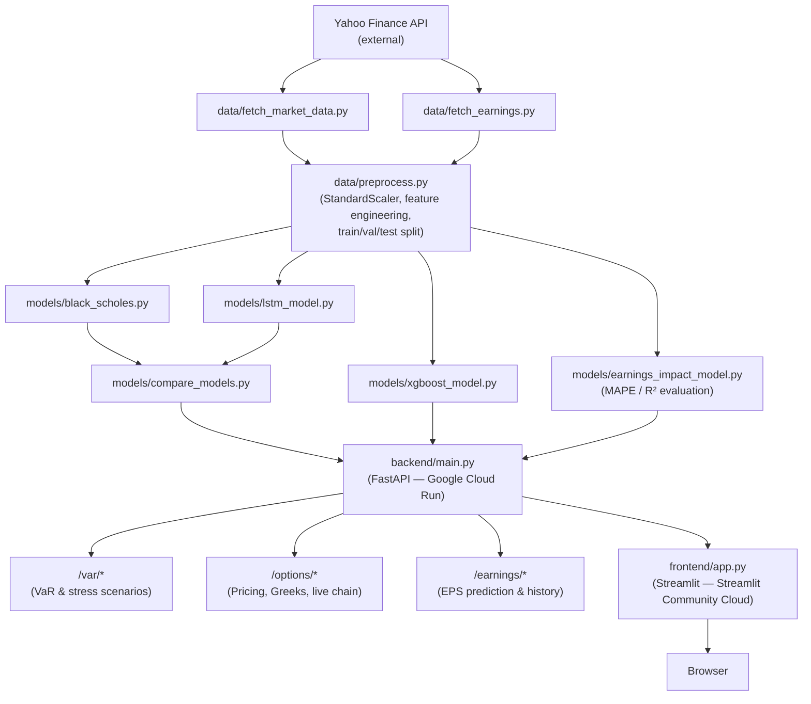

# Portfolio Risk Stress-Tester

**STATS 418 Final Project — Mark Wang, UCLA Department of Statistics & Data Science**

A full-stack system for options pricing, earnings impact prediction, and portfolio risk quantification. Collects live market data via Yahoo Finance, trains three complementary pricing models (Black-Scholes, XGBoost, LSTM) plus an earnings impact model, and exposes everything through a FastAPI backend and Streamlit dashboard.

> **Live App:** https://stats418-portfolio-risk-tester.streamlit.app
> **API Docs:** https://risk-api-388146732000.us-central1.run.app/docs

---

## Project Structure

```
stats418_final_project/
├── data/
│   ├── fetch_market_data.py   # yfinance: prices, options chains, vol surface
│   ├── fetch_earnings.py      # yfinance: EPS history, upcoming earnings dates
│   └── preprocess.py          # feature engineering, StandardScaler, train/val/test split
├── models/
│   ├── black_scholes.py            # analytical pricing, Greeks, VaR
│   ├── xgboost_model.py            # gradient boosting on options features
│   ├── lstm_model.py               # PyTorch LSTM for temporal dynamics
│   ├── earnings_impact_model.py    # XGBoost + delta-gamma: EPS surprise → option ΔP
│   └── compare_models.py           # MAPE / R² comparison across models
├── backend/
│   └── main.py                # FastAPI: pricing, VaR, earnings impact, options chain
├── frontend/
│   └── app.py                 # Streamlit: earnings predictor, VaR dashboard, BS pricer
├── scripts/
│   └── run_pipeline.py        # end-to-end: fetch → preprocess → train all models
├── presentation/              # proposal and final slides
├── eda_proposal.py            # generates proposal presentation figures
├── docker-compose.yml
└── requirements.txt
```

---

## Quickstart

### Option A — Docker (recommended)

```bash
# 1. Train models first (generates data and model weights)
python scripts/run_pipeline.py

# 2. Start both services
docker-compose up --build
```

- **Frontend:** http://localhost:8501
- **API docs:** http://localhost:8000/docs

### Option B — Local (no Docker)

```bash
pip install -r requirements.txt

# Train models
python scripts/run_pipeline.py

# Terminal 1 — backend
uvicorn backend.main:app --reload --port 8000

# Terminal 2 — frontend
streamlit run frontend/app.py
```

---

## Features

### Earnings Impact Predictor *(main feature)*
Enter any ticker to see its upcoming earnings date and EPS estimate, then slide an EPS surprise % slider to predict how a specific option's price would change. Powered by an XGBoost model trained on historical earnings events, with a delta-gamma approximation for option price impact.

### Portfolio VaR & Stress Test
Upload a portfolio CSV (`ticker, weight, sigma_daily`) to compute parametric Value-at-Risk at any confidence level and horizon. Run a stress scenario with a configurable market shock to see how VaR changes.

### Black-Scholes Option Pricer
Interactive pricer for calls and puts with live Greeks output (Delta, Gamma, Vega, Theta). Includes a Greeks-vs-spot visualization across a user-defined range.

---

## Data

Five tickers: **SPY, AAPL, NVDA, TSLA, QQQ** — all collected live via `yfinance`.

| Data Type | Records | Description |
|-----------|---------|-------------|
| Options Chain | ~5,100 | All available expirations with strikes |
| Greeks | ~5,100 | Delta, Gamma, Vega, Theta via Black-Scholes |
| Price History | ~1,260 | 252 trading days × 5 tickers |
| Volatility Surface | ~300 | IV by moneyness bucket and DTE |
| Earnings History | ~20 | EPS actual vs estimate, post-earnings stock moves |

---

## Models

| Model | Approach | Target |
|-------|----------|--------|
| Black-Scholes | Analytical, closed-form | Option price (baseline) |
| XGBoost | Gradient boosting on moneyness, IV, DTE, Greeks | Option price |
| LSTM | 21-day rolling window, PyTorch | Option price (temporal) |
| Earnings Impact | XGBoost → delta-gamma approximation | Post-earnings option ΔP |

---

## API Endpoints

Full interactive docs at `/docs` (Swagger UI).

| Method | Endpoint | Description |
|--------|----------|-------------|
| `GET` | `/health` | Health check |
| `POST` | `/var/parametric` | Parametric VaR from portfolio JSON |
| `POST` | `/var/historical` | Historical VaR from returns CSV |
| `POST` | `/var/portfolio_csv` | Parametric VaR from portfolio CSV |
| `POST` | `/options/price` | Black-Scholes price + Greeks |
| `GET` | `/options/chain/{ticker}` | Live options chain from yfinance |
| `GET` | `/earnings/{ticker}` | Upcoming date, EPS estimate, historical move stats |
| `GET` | `/earnings/history/{ticker}` | Last 8 quarters of EPS surprises + stock moves |
| `POST` | `/earnings/impact` | Predict option price change given EPS surprise |
| `POST` | `/stress/scenario` | VaR comparison under a market shock |

### Portfolio CSV format

```csv
ticker,weight,sigma_daily
SPY,0.4,0.008
AAPL,0.3,0.015
TSLA,0.3,0.025
```

---

## Deployment

| Service | Platform | URL |
|---------|----------|-----|
| Frontend (Streamlit) | Streamlit Community Cloud | https://stats418-portfolio-risk-tester.streamlit.app |
| Backend API (FastAPI) | Google Cloud Run | https://risk-api-388146732000.us-central1.run.app |

*Both services are live and accessible through June 9, 2026.*

---

## Solution Architecture



---

## AI Assistant Usage

This project was developed with significant assistance from **Claude Code (Sonnet 4.6)** by Anthropic, used interactively throughout the entire development lifecycle via the Claude Code CLI and VS Code extension.

### Tools Used

| Tool | Version | Primary Use |
|------|---------|-------------|
| Claude Code | Sonnet 4.6 | Primary AI assistant — code, debugging, deployment |

### How AI Assistance Was Applied

**Model Development**
- Structured the XGBoost training loop and hyperparameter setup (`xgboost_model.py`)
- Built the PyTorch LSTM architecture with 21-day rolling windows (`lstm_model.py`)
- Designed the earnings impact model combining XGBoost predictions with a delta-gamma approximation (`earnings_impact_model.py`)

**Backend (FastAPI)**
- Generated all endpoint stubs and Pydantic request/response models in `backend/main.py`
- Added structured logging via Python's `logging` module throughout the API
- Debugged CORS middleware configuration and Cloud Run port binding

**Frontend (Streamlit)**
- Built Streamlit tab layout, Plotly chart configurations, and session state management in `frontend/app.py`
- Implemented the live options chain with expiry date pickers, strike ordering, and re-fetch logic
- Debugged expiry-based price mismatch and front-month re-fetch resetting bugs

**Deployment & Infrastructure**
- Wrote and optimized `Dockerfile` for both frontend and backend services
- Configured `docker-compose.yml` for local development
- Resolved Cloud Run deployment issues (`.gcloudignore`, environment variable injection, Streamlit secrets)

### Particularly Helpful Interactions

- **Debugging live options chain state resets**: The expiry selector was resetting to the front month on every Streamlit re-run. Claude identified that session state was being overwritten on each widget render and proposed the correct initialization guard.
- **Cloud Run + yfinance incompatibility**: `earnings_dates` parsing failed silently on Cloud Run because `lxml` wasn't installed in the container. Claude identified the missing dependency and added it to `requirements.txt`.
- **Strike ordering bug**: Options chain strikes were returning in inconsistent order depending on expiry. Claude traced the issue to unsorted yfinance output and added an explicit sort before returning the response.

### Areas Requiring Manual Intervention

- Model weight tuning and validating that LSTM training converged on real options data required hands-on iteration beyond what AI could fully automate.
- Final decisions on which API endpoints to expose and how to structure the Streamlit tab layout were made by the developer.
- Verifying that deployed Cloud Run behavior matched local Docker output required manual testing against live market data.
- Visual frontend finetuning and stylistic changes.
- Added the earnings impact slider and P/E, PEG, EPS fundamentals panel with dual earnings charts.
- Implemented intuitive features based on knowledge of financial markets and how models are used in quantitative finance.

### Lessons Learned

- AI assistants are most effective when given specific, narrowly scoped tasks (e.g., "fix the session state reset on expiry change") rather than broad open-ended ones.
- Generated code for financial models (Black-Scholes, Greeks) is generally reliable because the formulas are well-defined; generated code for stateful UI (Streamlit session state) required more review.
- Iterating on deployment issues (Cloud Run, Streamlit Cloud secrets) with AI assistance significantly reduced debugging time compared to reading documentation cold.

---

## Requirements

Python 3.10+. See `requirements.txt` for pinned versions.

```
yfinance, pandas, numpy, scipy
scikit-learn, xgboost, torch
fastapi, uvicorn, pydantic
streamlit, plotly
```

---

## Timeline

**Apr 27 – June 1, 2026** (5 weeks)

| Phase | Dates | Status |
|-------|-------|--------|
| Data collection & EDA | Apr 27 – May 10 | Complete |
| Feature engineering | May 4 – May 11 | Complete |
| Black-Scholes baseline | May 4 – May 11 | Complete |
| XGBoost + Earnings models | May 11 – May 25 | Complete |
| LSTM model | May 18 – May 25 | Complete |
| Model comparison | May 25 – June 1 | Complete |
| Deployment & docs | May 25 – June 1 | Complete |
